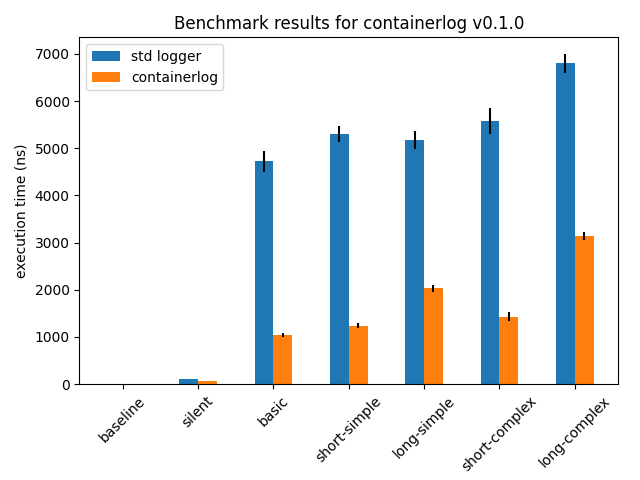

# containerlog

A lightweight, optimized, and opinionated structured logging library for Python, intended for containerized applications.

`containerlog` was born out of a desire to have high-quality structured logging for
containerized applications (e.g. microservices) without having to compromise detailed
logging for application/request latency.

[`structlog`](https://www.structlog.org/en/stable/) is a great general-purpose structured
logging library for Python, but being general-purpose means that there is additional overhead
when logging messages.

When [we](https://github.com/vapor-ware) updated a microservice to use structured logging,
we found that [request latency went up](https://github.com/vapor-ware/synse-server/issues/384),
seemingly due to the transition to use `structlog`.

`containerlog` is not for everyone. It is highly opinionated, minimally configurable,
and intentionally feature-sparse so that it can achieve [better performance](#benchmarks) than
the Python standard logger

Not every application needs optimized logging, but where latency and performance matters,
`containerlog` could work for you.

```
timestamp='2020-07-23T13:11:28.009804Z' logger='my-logger' level='debug' event='loading configuration' path='./config.yaml'
timestamp='2020-07-23T13:11:28.010137Z' logger='my-logger' level='info' event='starting application' 
timestamp='2020-07-23T13:11:28.010158Z' logger='my-logger' level='warn' event='having too much fun' countdown=[3, 2, 1]
```

## Installation

`containerlog` can be installed with pip:

```
pip install containerlog
```

It is only intended to work for Python 3.6+.

## Usage

The API for `containerlog` is sparse, thus simple. There are generally two things you will
ever need to do with it:

### 1. Creating/Configuring a Logger

Similar to the Python standard logger, a logger should in initialized in a module using `get_logger`

```python
# Logger using module as name
logger = containerlog.get_logger()

# Logger with explicit name set
logger = containerlog.get_logger('my-logger')
```

If `get_logger` is not given a name, it will use the name of the module.

There are only a handful of things which can be configured:

* The logger name
  ```python
  # Set name via `get_logger`
  logger = containerlog.get_logger('my-logger')
  ```
* The log level
  ```python
  # Set log level on a single logger
  logger.level = containerlog.INFO

  # Set log level for all loggers
  containerlog.set_level(containerlog.INFO)
  ```
* Where logs are written to. Generally this shouldn't need to be configured,
  though it may be useful when writing tests. `containerlog` writes to stdout and
  stderr by default.
  ```python
  # Set write target for non-error logs
  out_stream = io.StringIO()
  logger.writeout = out_stream.write

  # Set write target for error logs
  err_stream = io.StringIO()
  logger.writerr = err_stream.write
  ```

By default, `containerlog` logs at `DEBUG` level. This is an opinionated decision
with the thought that using this out of the box, its better to capture more logs than
fewer logs, though the appropriate log level should be set by the application. 

### 2. Logging a message

Once you have a logger, you can log a message at `trace`, `debug`, `info`, `warn`, `error`, or `critical` level.

```python
# Log at trace level
logger.trace('message to log')

# Log at debug level
logger.debug('message to log')

# Log at info level
logger.info('message to log')

# Log at warn level
logger.warn('message to log')
logger.warning('message to log')

# Log at error level
logger.error('message to log')

# Log at critical level
logger.critical('message to log')
```

Data passed in as keyword arguments to any of the logging methods gets rendered as
key-value pairs for the structured log.

```python
logger.info('connected to remote server', ip=server_ip, port=server_port)
```

> **Note**: Since this library is intended to be used for structured logging, avoid
> logging formatted message to avoid a performance penalty.
>
> If logging at INFO level,
>
> ```python
> logger.debug(f'got a new value: {value}')
> ```
>
> would not get logged, but the string formatting would still happen since it is being
> done upfront, not within the log function. Instead, pass it as a kwarg:
>
> ```python
> logger.debug('got a new value', value=value)
> ```

Log levels are modeled as integers internally. Logging can be disabled for a logger either
by calling `disable` on the logger, or by setting the level above `containerlog.CRITICAL`.

```python
# Disable via method
logger.disable()

# Disable via log level
logger.level = 99
```

## Optimizations

There are numerous sources discussion micro-optimizations in Python. This project probably
does not implement them all, so there is room for improvement. Current optimization work has
leveraged:

* [`dis`](https://docs.python.org/3/library/dis.html): to disassemble python bytecode for analysis 
* [`timeit`](https://docs.python.org/3/library/timeit.html): to measure execution time of code snippets

If you wish to contribute optimizations and use other libraries, tools, or sources, open a PR to add
them to this list.

## Benchmarks

Benchmarking scripts can be found in the [benchmarks](benchmarks) directory. To run,

```
$ cd benchmarks
$ ./run.sh
```

This will run benchmarks the Python standard logger and for `containerlog`. The latest results
can be found below.

### Results

Benchmarks were measured using Python 3.8.0 on macOS 10.15.1 with a 2.9 GHz 6-Core Intel Core i9
processor and 16 GB 2400 MHz DDR4 memory.



| Benchmark | std logger (ns) | containerlog (ns) |
| --------- | --------------- | ----------------- |
| baseline | 0.68 +/- 0.02 | 0.69 +/- 0.02 |
| silent | 110.0 +/- 6.0 | 57.8 +/- 1.4 |
| basic | 4720.0 +/- 220.0 | 1040.0 +/- 50.0 |
| short-simple | 5310.0 +/- 170.0 | 1240.0 +/- 60.0 |
| long-simple | 5180.0 +/- 190.0 | 2029.9999999999998 +/- 70.0 |
| short-complex | 5580.0 +/- 270.0 | 1430.0 +/- 90.0 |
| long-complex | 6800.0 +/- 200.0 | 3140.0 +/- 80.0 |

## Contribute

While `containerlog` is intentionally feature-sparse, feature requests are welcome. Additionally,
if you can find any other ways to micro-optimize the codebase, pull requests are very much
appreciated.

