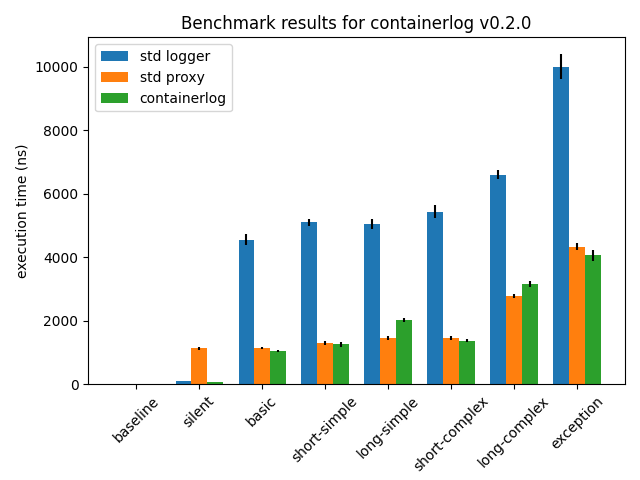

# containerlog

A lightweight, optimized, and opinionated structured logging library for Python, intended for containerized applications.

`containerlog` was born out of a desire to have high-quality structured logging for
containerized applications (e.g. microservices) without having to compromise detailed
logging for application/request latency.

[`structlog`](https://www.structlog.org/en/stable/) is a great general-purpose structured
logging library for Python, but being general-purpose means that there is additional overhead
when logging messages.

When [we](https://github.com/vapor-ware) updated a microservice to use structured logging,
we found that [request latency went up](https://github.com/vapor-ware/synse-server/issues/384),
seemingly due to the transition to use `structlog`.

`containerlog` is not for everyone. It is highly opinionated, minimally configurable,
and intentionally feature-sparse so that it can achieve [better performance](#benchmarks) than
the Python standard logger

Not every application needs optimized logging, but where latency and performance matters,
`containerlog` could work for you.

```
timestamp='2020-07-23T13:11:28.009804Z' logger='my-logger' level='debug' event='loading configuration' path='./config.yaml'
timestamp='2020-07-23T13:11:28.010137Z' logger='my-logger' level='info' event='starting application' 
timestamp='2020-07-23T13:11:28.010158Z' logger='my-logger' level='warn' event='having too much fun' countdown=[3, 2, 1]
```

## Installation

`containerlog` can be installed with pip:

```
pip install containerlog
```

It is only intended to work for Python 3.6+.

## Usage

See the documentation at https://containerlog.readthedocs.io/en/docs/

## Optimizations

There are numerous sources discussion micro-optimizations in Python. This project probably
does not implement them all, so there is room for improvement. Current optimization work has
leveraged:

* [`dis`](https://docs.python.org/3/library/dis.html): to disassemble python bytecode for analysis 
* [`timeit`](https://docs.python.org/3/library/timeit.html): to measure execution time of code snippets

If you wish to contribute optimizations and use other libraries, tools, or sources, open a PR to add
them to this list.

## Benchmarks

Benchmarking scripts can be found in the [benchmarks](benchmarks) directory. To run,

```
$ cd benchmarks
$ ./run.sh
```

This will run benchmarks the Python standard logger and for `containerlog`. The latest results
can be found below.

### Results

Benchmarks were measured using Python 3.8.0 on macOS 10.15.1 with a 2.9 GHz 6-Core Intel Core i9
processor and 16 GB 2400 MHz DDR4 memory.



| Benchmark | std logger (ns) | std proxy (ns) | containerlog (ns) |
| --------- | --------------- | -------------- | ----------------- |
| baseline | 0.64 +/- 0.01 | 0.64 +/- 0.01 | 0.65 +/- 0.01 |
| silent | 102.0 +/- 3.0 | 1120.0 +/- 40.0 | 56.2 +/- 1.3 |
| basic | 4550.0 +/- 160.0 | 1130.0 +/- 40.0 | 1030.0 +/- 30.0 |
| short-simple | 5090.0 +/- 120.0 | 1300.0 +/- 60.0 | 1250.0 +/- 70.0 |
| long-simple | 5040.0 +/- 170.0 | 1440.0 +/- 60.0 | 2020.0 +/- 70.0 |
| short-complex | 5430.0 +/- 200.0 | 1450.0 +/- 60.0 | 1370.0 +/- 50.0 |
| long-complex | 6590.0 +/- 140.0 | 2770.0 +/- 60.0 | 3160.0 +/- 100.0 |
| exception | 10000.0 +/- 400.0 | 4330.0 +/- 120.0 | 4050.0 +/- 170.0 |

## Contribute

While `containerlog` is intentionally feature-sparse, feature requests are welcome. Additionally,
if you can find any other ways to micro-optimize the codebase, pull requests are very much
appreciated.

